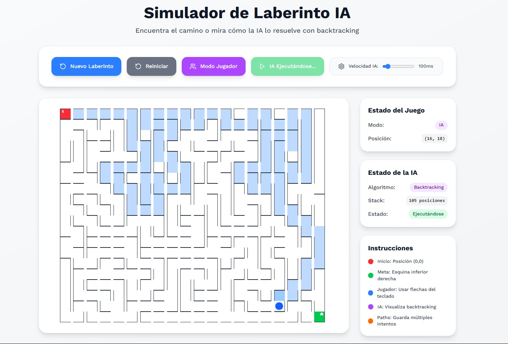

# 🧩 Maze Simulator AI

This project is a modern, interactive maze simulator built with React and TypeScript. It has been a fantastic learning journey where I practiced:

* 🎨 **Frontend Design**: Creating a clean, responsive UI using Tailwind CSS.
* ⚛️ **React Hooks**: Building and extracting custom hooks for different logic layers (maze generation, AI pathfinding, player movement, and path tracking).
* 🧠 **Algorithms**: Implementing and visualizing the backtracking algorithm to generate random mazes and guide the AI through them.
* 🕹️ **User Interaction**: Managing keyboard events, state resets, and smooth animations.
* 🧩 **Code Architecture**: Refactoring a large monolithic component into a modular structure with reusable hooks and components.

Through this project, I learned how to:

✅ Keep React components clean by separating concerns.
✅ Use state management effectively across complex interactions.
✅ Create maintainable code that is ready to extend with new features (like other AI algorithms or additional modes).
✅ Debug and handle asynchronous flows safely (e.g., cancelling AI animations).

Overall, this project reflects my progress as a **Frontend Developer and Designer**, combining both technical problem-solving and UI craftsmanship. 🌟
